# Photic Gallery

<p align="center">
  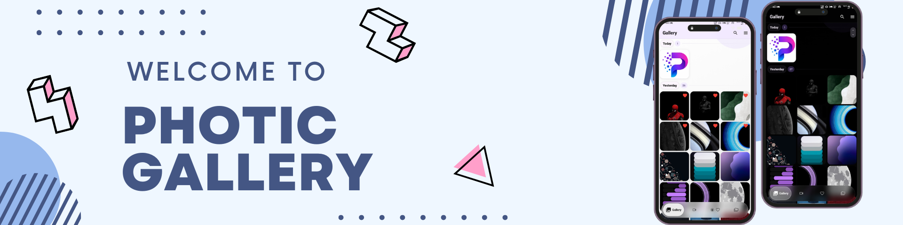
</p>

<p align="center">
  A premium, local-first Flutter gallery built for people who want one polished place to browse photos, watch videos, protect private media, recover deleted items, and play music stored on the device.
</p>

<p align="center">
  
  
  
  
  
</p>

<p align="center">
  <a href="#overview">Overview</a> •
  <a href="#why-it-stands-out">Why It Stands Out</a> •
  <a href="#feature-breakdown">Feature Breakdown</a> •
  <a href="#screenshots">Screenshots</a> •
  <a href="#tech-stack">Tech Stack</a> •
  <a href="#getting-started">Getting Started</a>
</p>

## Overview

Photic Gallery is not a demo gallery shell. It is a full media experience with:

- a fast sectioned gallery for local photos
- a dedicated video tab and immersive video viewer
- favorites, albums, recycle bin recovery, and bulk actions
- a hidden safe folder with PIN and biometric support
- a local music browser, mini-player, and full player
- polished light and dark themes with a glass-heavy visual style

This repository contains the Flutter app, platform configuration, launcher icons, and the screenshots used below.

## Cover Preview

<p align="center">
  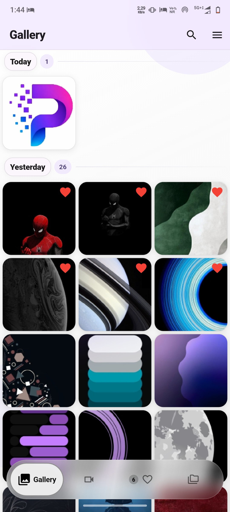
  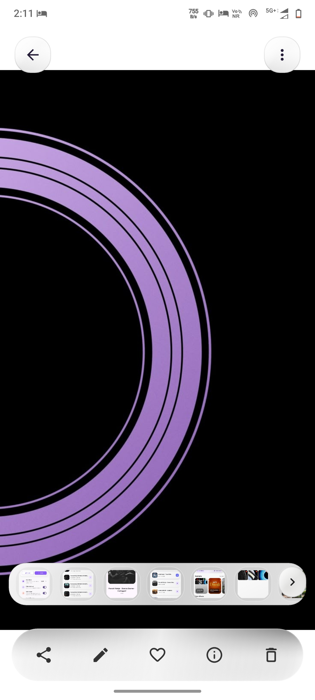
  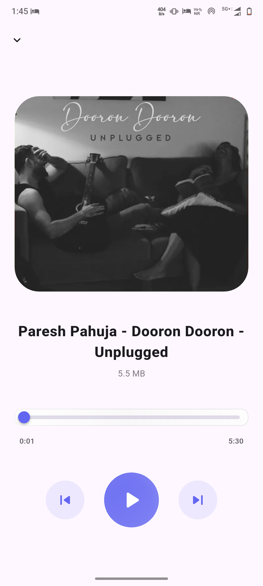
  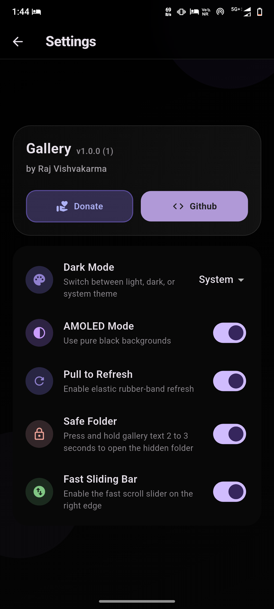
</p>

## Why It Stands Out

- Local-first by design. The app works with on-device media instead of building around a cloud backend.
- One app, multiple media workflows. Photos, videos, albums, favorites, recycle recovery, private storage, and music playback live in one coherent UI.
- Premium presentation. Frosted surfaces, soft gradients, rounded cards, and light/dark styling give the app a more intentional feel than a stock gallery clone.
- Real utility features. Rename, share, edit, move to safe folder, restore from recycle bin, and wallpaper actions are built into the media flows.
- Privacy-aware vault. The safe folder supports PIN setup, biometric unlock, and screenshot protection while sensitive content is open.

## Feature Breakdown

### Gallery Core

- Sectioned gallery layout grouped by recency.
- Fast grid browsing with thumbnail warming and pagination.
- Pinch-based density changes for the photo grid.
- Dedicated tabs for gallery, videos, favorites, and albums.
- Bulk selection actions for favorite, recycle, and safe-folder moves.

### Viewer Experience

- Full-screen photo viewer with swipe navigation.
- Zoomable image presentation powered by `photo_view`.
- Quick actions for share, edit, favorite, info, delete, rename, and safe-folder move.
- Wallpaper actions wired through native Android channels.
- Video playback with immersive controls and viewer-specific flows.

### Organization Tools

- Favorites tab with visual heart-marked items.
- Albums tab with highlight cards, album counts, and drill-down browsing.
- Search with quick filters for Camera, Downloads, Screenshots, and Videos.
- Recent search history stored locally for repeat lookups.

### Recycle & Recovery

- Soft-delete flow instead of immediate permanent removal.
- Recycle bin list with restore and delete-forever actions.
- Bulk restore and empty-bin actions.
- Media filtering so binned items stop polluting the main browsing experience.

### Privacy & Safe Folder

- Hidden safe-folder entry triggered from the gallery flow.
- PIN creation and confirmation flow.
- Biometric unlock support when available on the device.
- Screenshot blocking via native secure-screen handling.
- Locked vault behavior when the app backgrounds.

### Music

- Local music discovery through device media access.
- Dedicated music list screen with artwork handling.
- Full music player with playback controls and progress.
- Persistent mini-player so playback survives navigation.
- Embedded metadata and album-art fallbacks.

### Personalization

- Light, dark, and system theme modes.
- AMOLED mode for deeper blacks.
- Pull-to-refresh toggle.
- Fast sliding bar toggle.
- Accent-aware theming through app settings state.

## Screenshots

### Main Surfaces

<p align="center">
  
  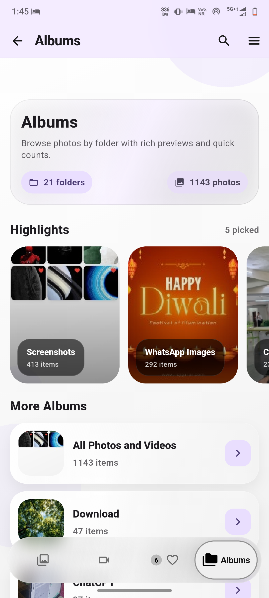
  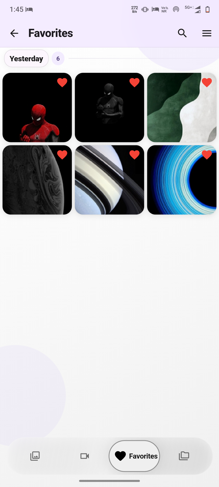
  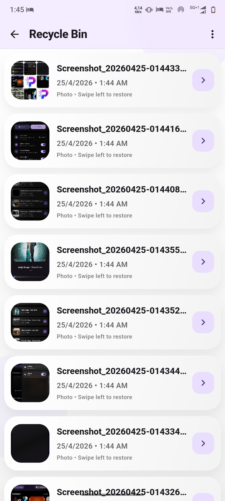
</p>

### Media Actions

<p align="center">
  
  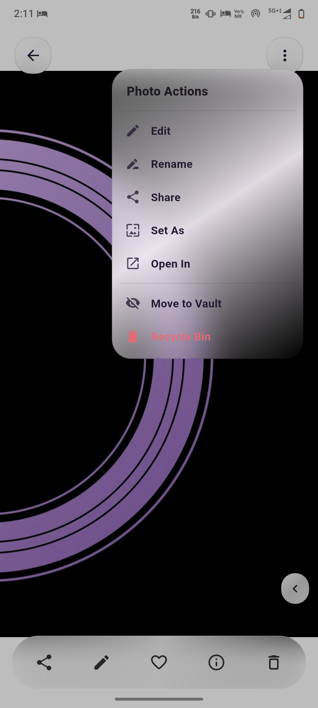
  
  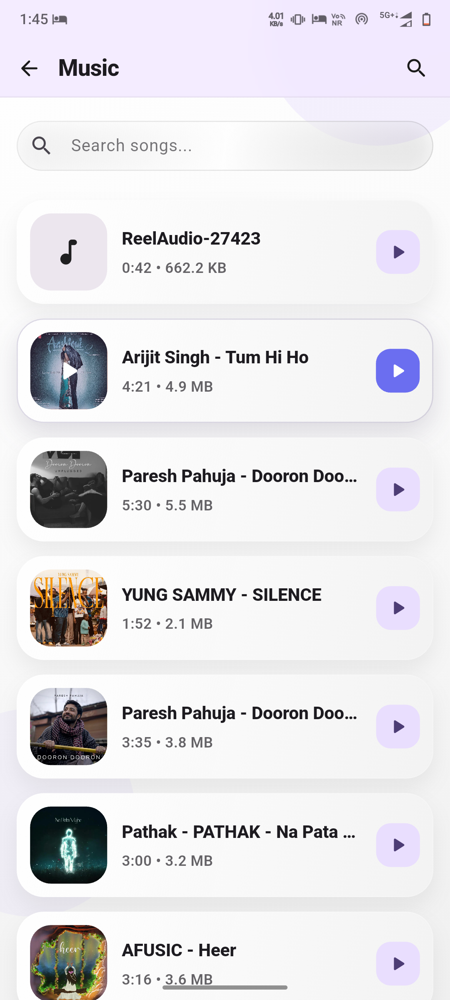
</p>

### Navigation & Theme

<p align="center">
  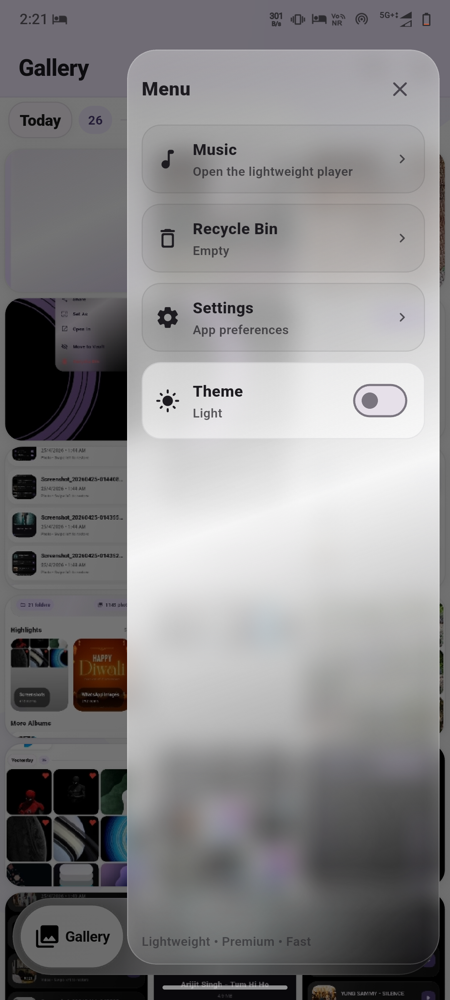
  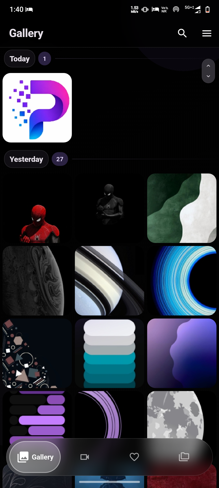
  
  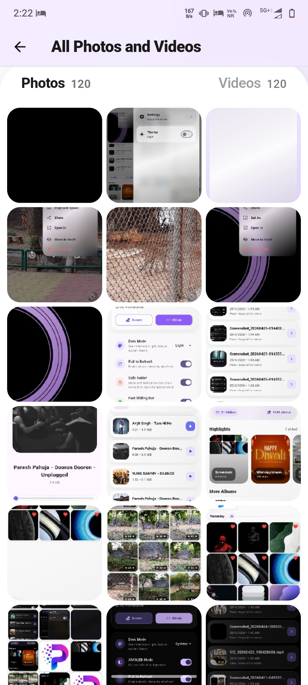
</p>

## Product Snapshot

| Area | Included in the app |
| --- | --- |
| Photos | Grid browsing, favorites, albums, viewer, editing, share, rename |
| Videos | Video tab, dedicated viewer, immersive playback |
| Private media | Hidden safe folder, PIN, biometrics, screenshot protection |
| Recovery | Recycle bin with restore and delete-forever actions |
| Music | Local music library, player screen, mini-player, album art |
| Search | File name, relative path, quick filters, recent searches |
| Settings | Theme modes, AMOLED mode, pull-to-refresh, fast scroll toggle |

## Tech Stack

### Framework

- Flutter
- Dart

### State & App Layer

- `flutter_riverpod`
- `provider`

### Media & UI

- `photo_manager`
- `photo_manager_image_provider`
- `photo_view`
- `video_player`
- `chewie`
- `pro_image_editor`
- `share_plus`

### Audio

- `just_audio`
- `audio_service`
- `flutter_media_metadata`

### Storage, Permissions, Security

- `sqflite`
- `shared_preferences`
- `flutter_secure_storage`
- `local_auth`
- `permission_handler`
- `package_info_plus`
- `path_provider`
- `path`
- `url_launcher`

## Project Structure

```text
lib/
  main.dart                        App bootstrap, themes, and root navigation
  gallery_screen.dart              Main gallery shell and tab-driven media experience
  viewer_screen.dart               Full-screen image viewer and actions
  video_viewer_screen.dart         Video playback flow
  album_detail_screen.dart         Album-specific browsing
  search_screen.dart               Search, quick filters, and recent queries
  music_screen.dart                Local music list
  music_player_screen.dart         Full now-playing experience
  mini_music_player.dart           Persistent mini-player
  settings_screen.dart             Theme, behavior, and utility settings
  vault_lock_screen.dart           PIN and biometric unlock flow
  vault_screen.dart                Safe-folder content management
  services/                        Media loading, vault, recycle bin, favorites, audio, storage
  gallery/                         Shared gallery widgets and layout helpers
assets/
  *.png                            README screenshots, logo, and icon source files
```

## Permissions

The app uses device permissions for real media management features.

### Android

- `READ_MEDIA_IMAGES`, `READ_MEDIA_VIDEO`, `READ_MEDIA_AUDIO`
- `READ_EXTERNAL_STORAGE` and `WRITE_EXTERNAL_STORAGE` for legacy Android behavior
- `USE_BIOMETRIC` and `USE_FINGERPRINT` for vault unlock
- `SET_WALLPAPER` for wallpaper actions from the viewer

### iOS

- Photo library access for gallery browsing
- Photo library add access for saving edits
- Face ID usage for private vault access

## Getting Started

### Prerequisites

- Flutter SDK 3.x
- Dart SDK 3.x
- Android Studio or Xcode, depending on target platform

### Install

```bash
git clone <repo-url>
cd photic_gallery
flutter pub get
```

### Run

```bash
flutter run
```

### Useful Commands

```bash
flutter analyze
flutter test
flutter pub run flutter_launcher_icons
```

## Current Identity

- App name: `Photic Gallery`
- Dart package: `photic_gallery`
- Android/iOS bundle id family: `com.example.photicgallery`

## Notes

- The screenshots in `assets/` are reused directly in this README.
- The repository includes Flutter platform directories for Android, iOS, macOS, Windows, Linux, and web.
- The strongest media-management experience is centered on mobile device libraries and native permissions.

## Roadmap Ideas

- Better metadata and media detail surfaces
- More advanced album and search filters
- Deeper music queue management
- Additional vault tooling and restore workflows
- More viewer utilities and media actions

## Contributing

If you improve the UI, features, or platform integration, update the README so it stays aligned with the actual product instead of drifting into generic documentation.

## Credits

Designed and built by Raj Vishvakarma.
