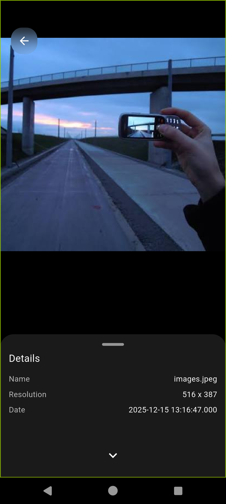

# Gallery App

A polished Flutter media manager with a glassmorphism UI for browsing photos and videos, protecting private items, and playing local music in one place.

## Screenshots

<p align="center">
  
</p>

### Home / Gallery

<p align="center">
  
</p>

### Image Viewer

<p align="center">
  
</p>

### Video Viewer

<p align="center">
  
</p>

### Vault

<p align="center">
  
</p>

### Music

<p align="center">
  
</p>

### Search

<p align="center">
  
</p>

## Overview

Gallery App brings your media tools together in a single, clean interface. The app focuses on fast browsing, smooth media viewing, private storage, and local music playback with a premium visual style.

## Highlights

- Browse photos and videos with a fast, sectioned gallery layout.
- Open images in a full-screen viewer with pinch-to-zoom, swipe navigation, thumbnail strips, sharing, editing, favoriting, and recycle-bin support.
- Play videos with immersive controls, playback speed selection, and share actions.
- Store private media in a locked vault with biometric-ready protection and screenshot blocking.
- Search media by file name, folder, and type with quick filters for Camera, Downloads, Screenshots, and Videos.
- Play local music with a dedicated player and a persistent mini-player.
- Recover deleted items from the recycle bin instead of losing them permanently right away.
- Switch between light, dark, and system theme modes.

## Key Features

### Gallery

- Smart home screen with images, videos, favorites, albums, music, recycle bin, and vault entry.
- Smooth pagination and thumbnail warming for better scroll performance.
- Pinch gestures to change the grid density.
- Sectioned gallery organization for easier browsing.

### Image Viewer

- Full-screen photo viewer with swipe navigation.
- Thumbnail strip for fast jumping between images.
- Details sheet, share action, edit action, and favorite toggle.
- Delete-to-recycle-bin flow for safer cleanup.

### Video Viewer

- Immersive playback with clean controls.
- Playback speed sheet for quick speed changes.
- Share and open-with actions.
- Full-screen experience with system UI handling.

### Vault

- Secure area for private photos and videos.
- Biometric-ready locking flow.
- Screenshot protection while the vault is open.
- Restore or permanently delete items from inside the vault.

### Music

- Local audio browser powered by the device media library.
- Full player screen for playback control.
- Mini-player that stays available while you continue browsing.
- Album art and fallback artwork support.

### Search

- Search by file name, folder, and media type.
- Quick filters for common folders like Camera, Downloads, Screenshots, and Videos.
- Recent search history for faster repeat queries.

## Tech Stack

- Flutter
- Dart
- `provider`
- `photo_manager`
- `photo_view`
- `video_player`
- `chewie`
- `just_audio`
- `audio_service`
- `pro_image_editor`
- `share_plus`
- `sqflite`
- `shared_preferences`
- `flutter_secure_storage`
- `local_auth`
- `google_mlkit_image_labeling`
- `google_mlkit_face_detection`

## Getting Started

1. Clone the repository.
   ```bash
   git clone <repo-url>
   cd pixora
   ```
2. Install dependencies.
   ```bash
   flutter pub get
   ```
3. Run the app.
   ```bash
   flutter run
   ```

## Permissions

This app needs access to local media and, for some features, secure device capabilities.

- Photos and videos permission for gallery browsing
- Audio/media permission for music scanning
- Biometric or secure storage access for vault protection

## Project Structure

```text
lib/
  main.dart                 App entry point and theme setup
  gallery_screen.dart       Main home screen and navigation hub
  viewer_screen.dart        Full-screen image viewer
  video_viewer_screen.dart  Full-screen video viewer
  vault_screen.dart         Secure vault content screen
  vault_lock_screen.dart    Vault unlock flow
  music_screen.dart         Music browser
  music_player_screen.dart  Full music player
  mini_music_player.dart    Persistent mini player
  search_screen.dart        Media search overlay
  services/                 Databases, media services, audio, vault, and recycle bin
  gallery/                  Gallery layout helpers and widgets
```

## Roadmap

- Better search and filter shortcuts
- More music player polish
- Expanded video tools
- Recycle bin improvements
- Additional secure-folder features

## Contributing

Issues and pull requests are welcome. If you improve a section, keep the documentation aligned with the codebase and the current UI behavior.

## Credits

If this project helped you, consider giving it a star.
